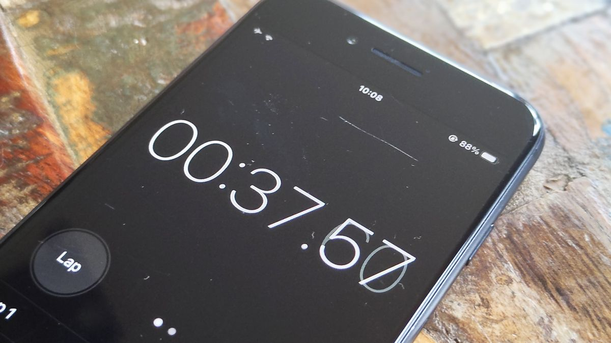

*Should I really be timing myself and adding extra pressure to this task?*

  

## Making Effort Estimations

The only way to estimate effort in an effective way is by using experience. Every time a task was assigned, I looked back on all of the times that I was assigned something similar, and then made an educated guess on how long I would take. I was always generous with the time that I gave myself, since I know hiccups can occur in the development process. This also applied to when I was estimating effort for tasks give it to others as well.

## Benefits of Effort Estimations

Despite my effort estimations being usually off, I always found them beneficial. When I work under a time constraint, I usually work faster and more efficiently. Making effort estimations usually gave me a soft time constraint that I could use to my advantage. And even when I did not meet that time constraint, I knew what I had to improve on afterwards.

## Tracking Actual Effort

Tracking actual effort was useful because it showed what I had to improve on. One thing I noticed recently was that I usually get stuck on something for too long, making me go past the time limit. Now that I'm tracking actual effort, I can work towards fixing that. Catching small things like that is the only way to kick bad habits to the curb.

I usually tracked my actual effort with a simple phone timer. I found it the simplest and most realistic way to keep track of how long that I was taking on each assignment. However, one weakness of using a phone timer is that I did not account for testing time, and time spent after the fact where I was fixing some issues with the code I wrote under the time constraint.

## Overall...

In the case of basic effort tracking, I felt like I have been doing fine so far. However, if I wanted to improve one thing I could do is use a more sophisticated method of tracking. Next time, I will also give myself more time to take into account unit testing, and general bug fixing. Even though it does take more effort, I believe that this practice is something that every software engineer should develop to help their fellow colleagues.
