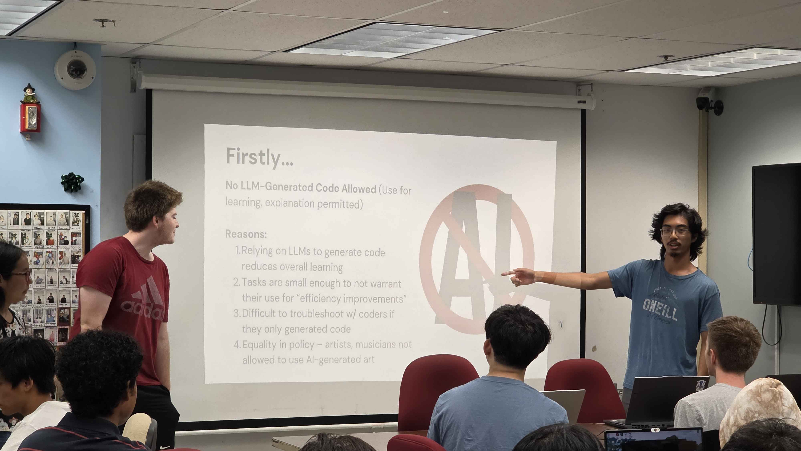

*Sofware Engineering might be cool, right?*

  
  

## Getting the chops
My interest in software engineering is getting the chops of it down. My main goal is to be able to lead a team of programmers to create software fast. I am studying game development at the moment, and will need to be able to convey the right information at the right time. This is a crucial step in learning how to become an efficient leader, where I don't waste anybody's time and am able to produce things quickly. In order to facilitate learning how to manage projects related to software engineering, I will learn how to use GitHub to keep track of the work of many people at once. It would be useful to even look into some other methods of team communication, but my main interest is learning how to NOT waste time.

## Contributing to the club
As a member of the UHM Game Dev Club, I want to be able to contribute to my club as best as possible. From my class, I learned that software engineering is a discipline that requires time and practice, and that is something that I need to master if I want to proceed with my career. Learning how to accomplish things in a set deadline, and with constraints is one of the key areas that I will work on, as every job I have in the future will likely pose the same issues. This will also give me a better understanding of how to set deadlines for others, and to know how much time it shold take to finish a certain task. Getting more experience with having to do projects quickly and with quality is my main interest if I go into the field of software engineering.

## GitHub
GitHub has been a weakness of mine for as long as I started programming. As I never published anything I worked on, I never got the chance to experience anything that GitHub has to offer, and by proxy never learned how to use or interact with it. By going into software engineering, I know that I will learn a lot about not only GitHub, but other common platforms and frameworks as well. I am excited to learn about all of the software that I am not privy to, and apply it to my own projects. If I want to understand what my team is working on in the club as well, I need to learn how to read what is going on in a GitHub project. In my field of interest, knowing which software to use for what purposes is going to be vital going forward, and I will need to open myself up to criticism and feedback if I want to go anywhere. 
