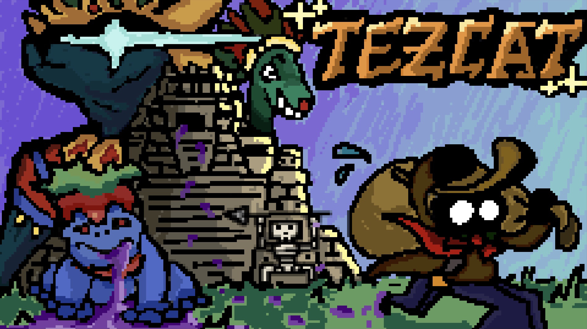
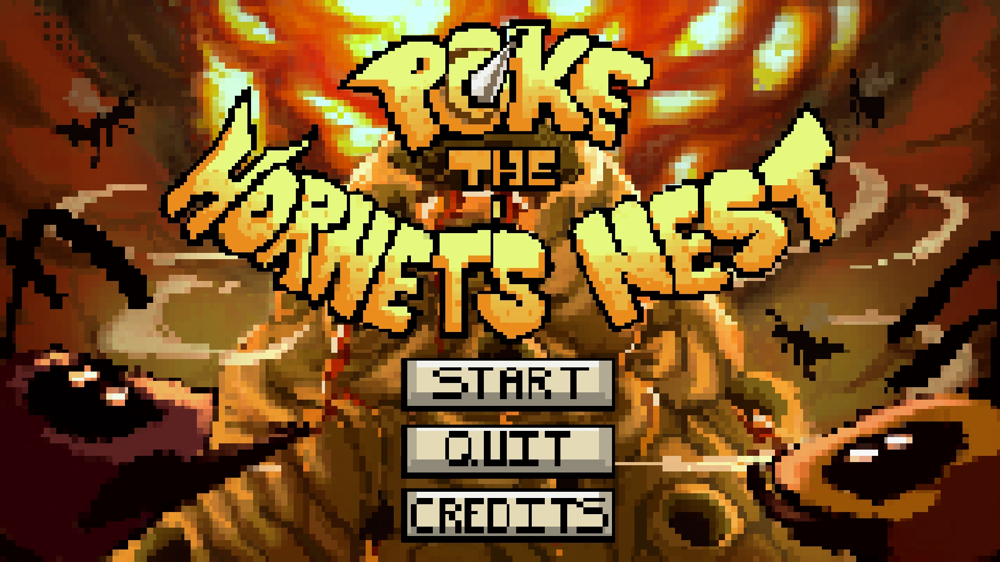

itch.io page: https://uhmanoagamedev.itch.io

  
  
  

Ever since I have enrolled at UH Manoa, I have been a part of the Game Dev Club! At first, I was a musician who made a song for each project I worked on, but later, I became Assistant Project Manager, and later Producer for the club's projects! Here is a list of games that I have worked on with the club:

Tezcat - The theme was "Temptation", and we had decided to make a resource management roguelite about thievery! I had worked on the main theme for this one!

Poke The Hornet's Nest - The theme was "Territorial", and for this one we had decided to make a puzzle platformer involving using the recoil from your bomb in order to move around the level. I had worked on the boss theme for this one!

DreaMeter - The theme for this one was "Dreaming". This was actually the first project that I wasn't a musician for, but instead the Assistant Project Manager! It was my first foray into helping different teams stay on track, and was a huge learning experience!
